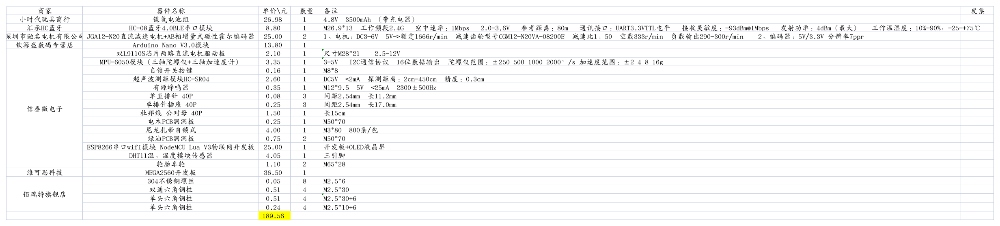
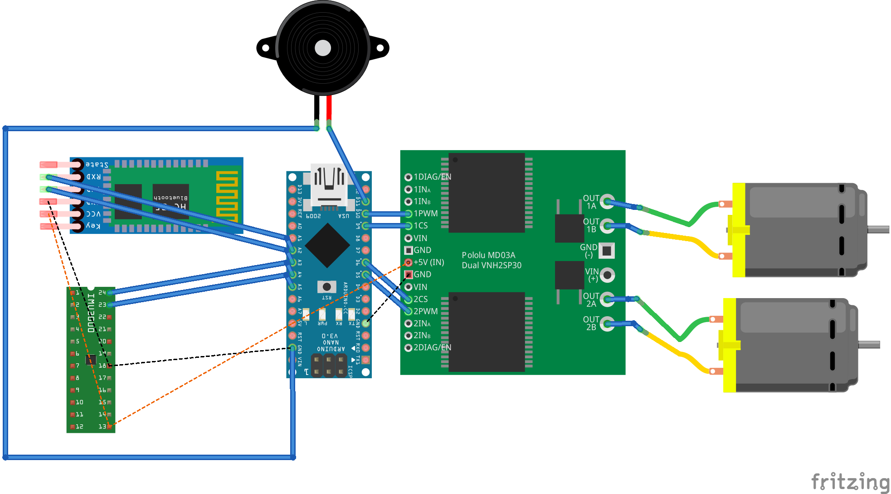
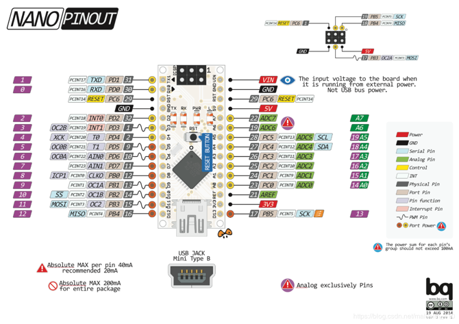
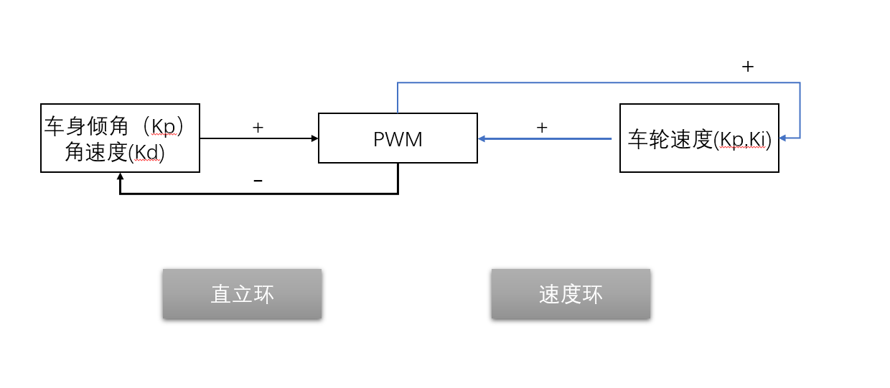
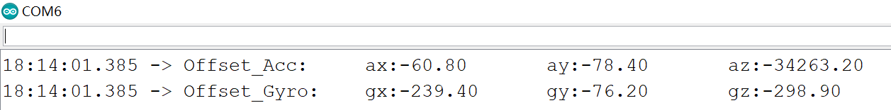

# Balancar

为了实现两轮自平衡采用 PID 闭环控制算法，利用手机内部重力感应和语音识别模块通过 HC-08 模块远程调参并控制小车运动状态，最终通过温湿度模块实时远程监测室内环境。

<video src="Docs/Videos/Balancar_video.mp4"></video>

- PID 算法、IMU、里程计、I2C协议 、UART 协议、Modbus 协议、定时中断、Arduino 等
- 使用互补滤波器，融合 mpu6050 的陀螺仪和加速度计，简便有效地得到 IMU 姿态估计
- 使用定时器中断，及时反馈编码器的转速，得到里程计速度估计
- 对姿态环和速度环进行 PID 闭环控制，通过手机端实时调参

## 硬件部分

## 软件部分

## 调参测试

